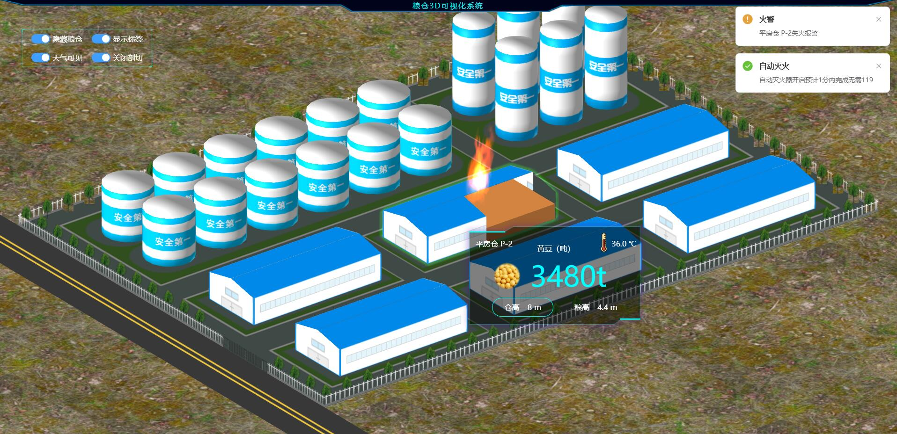
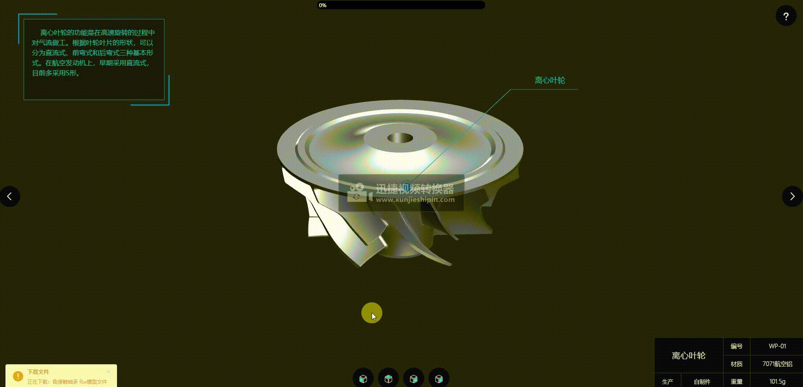
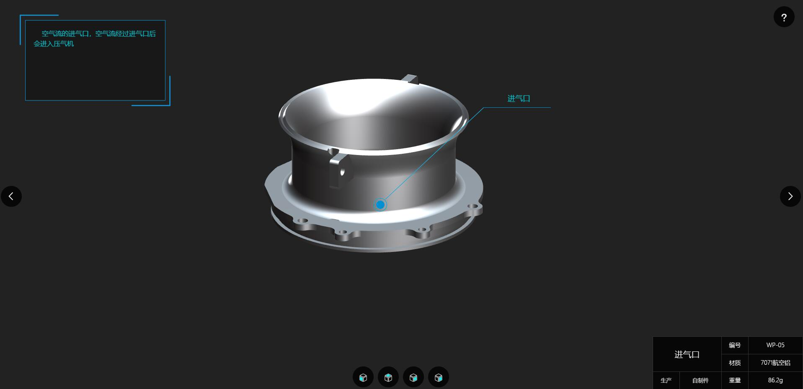

# Vue3 + Vite + TypeScript + ThreeJS + WebGL + Element-Plus + Sass

   本程序主要参考[郭老师](http://www.yanhuangxueyuan.com)教程，基于Vue3改写，为了加强对Vue3和ThreeJS的学习，本源码仅供参考学习使用。

   
## 运行效果

 ### 3D粮仓
 
  
 
  
 
 ### 工业器件
 
  
 
  
 

## 如何使用

 ### 克隆项目
 
 ### 安装依赖
 
 npm install or yarn add
 
 ### 启动项目
 
 npm run dev
 
 ### 项目打包
 
 npm run build
